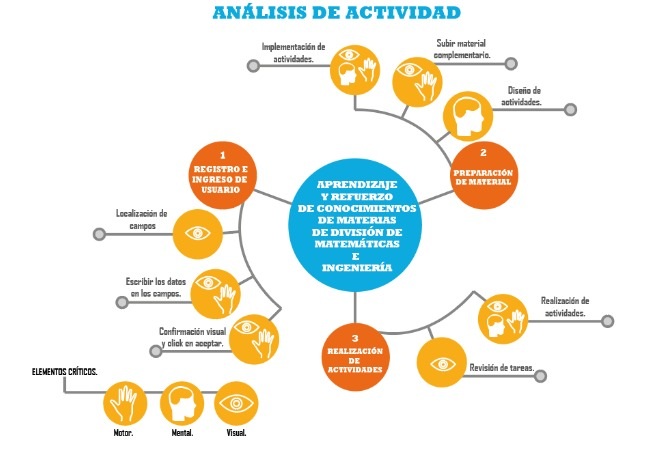
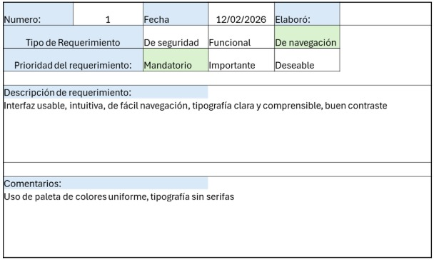
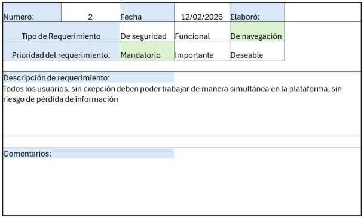
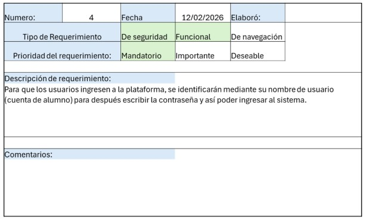
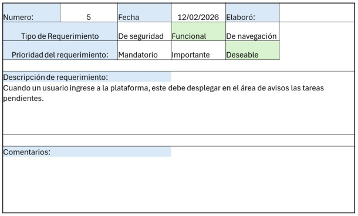
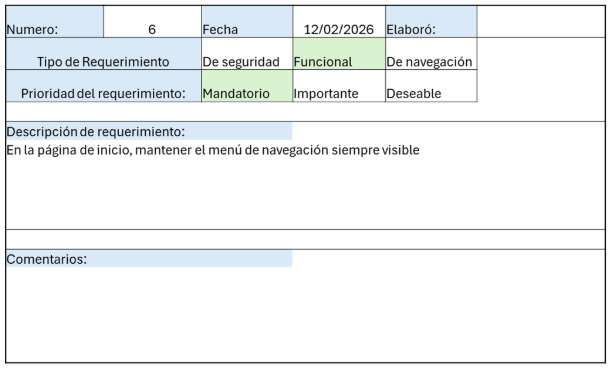

# Proyecto Desarrollo Web

Elaborado por:

Trinidad Potrero Josue  
Martínez Rodríguez Fernando  
Quiñones Valles Pamela  
Aguilar Buendia Bruno  
Hernández Mendoza Daniela Itzel

# Comprendamos el propósito.  
Este proyecto surge ante la necesidad de la comunidad universitaria de la Fes Acatlán, de no encontrar una manera de como liberar su servicio social o tomar asesorías con tutores (adjuntos) preparados en la materia de su elección para mejorar su aprovechamiento escolar, como requisitos el estudiantado que quiera hacer su servicio social dando asesorías deberá cumplir con los créditos necesarios de acuerdo a su carrera, además de haber acreditado un examen de prueba con una calificación aprobatoria mínima de 8 para constar de su alto dominio en la materia, el alumno que solicite asesorías tendrá que estar inscrito al semestre en curso.

## Identificación de la problemática.   
**Objetivo:** Los alumnos universitarios a veces no saben como organizarse con sus tareas nosotros crearemos un organizador de tareas donde además los alumnos podrán tomar asesorías en la materia que lo requieran y los alumnos que cuenten con los créditos necesarios y requerimientos pedidos podrán liberar su servicio social y obtener una constancia.

### ¿Qué situaciones causan frustración, dificultad o pérdida de tiempo a las personas?   
El no saber una alternativa sin salir de la escuela para liberar tu servicio social esta sería una gran alternativa para ahorrar tiempo y dinero en las personas además de  que los alumnos también podrán consultar grupos de un máximo de 15 personas para asesorías, en la página se les asignará un tutor, un salon, disponibilidad y horarios correspondientes.

### ¿Qué actividades podrían mejorar si existiera una mejor comunicación, organización o acceso a información?  
Una actividad que podría mejorar sin duda sería la organización de los salones para tener las asesorías, al igual que el servicio social.

### ¿A quiénes afecta este problema?   
A la comunidad universitaria de la Fes Acatlán.

### ¿Por qué es importante resolverlo?  
Porque hay alumnos que no cuentan con los recursos suficientes para poder liberar su servicio social por fuera de la escuela, además hay alumnos que no saben si se pueden dar asesorías de alguna de sus materias correspondientes a su carrera.

**Problema identificado:** Algunos estudiantes no saben como liberar su servicio social sin salir de la escuela y otros alumnos no saben si pueden tomar asesorías de materias.

## Definición del usuario objetivo.

### ¿Quién es tu usuario principal?

El usuario principal son estudiantes universitarios activos de la FES Acatlán, aquellos que desean liberar su servicio social mediante asesorías, que necesitan apoyo académico en determinadas materias, ofrecer tutorías en temas de su dominio o utilizar un organizador para gestionar sus actividades académicas.

 ### ¿Qué características tiene?

- Edad aproximada: Estudiantes de licenciatura  
- Nivel educativo: Licenciatura en curso.  
- Experiencia tecnológica: Media a alta (que tengan un uso frecuente de plataformas digitales).  
- Ocupación: Estudiantes inscritos en el semestre actual.  
- Algunos pueden estar en semestres avanzados con los créditos necesarios para realizar servicio social.

 ### ¿Cuál es su necesidad o frustración principal?

Existen dos perfiles principales dentro de los usuarios:

1. Estudiantes que necesitan liberar su servicio social, pero:  
- No saben cómo hacerlo dentro de la institución.  
- No cuentan con recursos económicos o tiempo para realizarlo fuera de la universidad.  
- No conocen alternativas internas que sean accesibles.

2. Estudiantes que necesitan asesorías académicas, pero:  
- No saben con quién acudir.  
- No encuentran información clara sobre tutorías disponibles.  
- No existe algún sistema organizado para asignación de tutor, salón y horarios.

### ¿Qué busca lograr al utilizar la solución?

- Liberar su servicio social sin salir de la institución o como alguna alternativa a ser adjunto.  
- Obtener una constancia oficial por su participación como asesor.  
- Recibir asesorías académicas para reforzar un tema o aprender sobre otros temas.  
- Mejorar su rendimiento escolar.  
- Ahorrar tiempo y dinero.  
- Tener claridad en horarios, salones y disponibilidad de tutores.

## Requisitos esenciales.

**Objetivo:** definir las funciones imprescindibles para que tu proyecto cumpla su propósito.

* Contar con personal fiable para llevar a cabo las asesorías.  
* Utilizar una interfaz limpia y de fácil comprensión.  
* Sección de grupos de estudio y asesorías.  
* Mostrar las credenciales necesarias en los perfiles de los asesores.  
* Calendario para agendar las actividades y notificar a los usuarios.  
* Manera de formar equipos para actividades que lo requieran.  
* Pantalla o ventana donde aparezcan las tareas completadas, faltantes y recientes.  
* Interfaz limpia.

  
  
  
  
  
  
  
  
  
  
  

    
    

### Requerimientos adicionales.

* Personalización de perfil del usuario.  
* Visualización de datos sobre las asesorías.  
* Chat de mensajes entre alumnos.  
* Centro de notificaciones.  
* Calendario para fechas de trabajos o tareas.  
* Reseñas de asesores.

### Aspectos no técnicos pero esenciales del proyecto

* Tono y lenguaje del sitio : El sitio contará con un tono semi-formal y  claro adaptado al contexto universitario, específicamente al de la Facultad de estudios superiores Acatlan. Se busca que sea un lenguaje con profesionalismo institucional al igual que sea cercano y juvenil ya que va dirigido a estudiantes.  
* Accesibilidad: Se busca un diseño bastante intuitivo para que cualquier estudiante pueda utilizarlo fácilmente por lo que tendrá una interfaz limpia ,  menú intuitivo, instrucciones paso a paso en el caso de los registros, para la postulación de asesor y para agendar asesorías.   
* Sustentabilidad del proyecto: El proyecto está pensado para ser sostenible en el tiempo y al lograr una integración dentro de la institución, no se requiere de inversiones externas si no de mantenimiento digital que puede darse de igual manera por alumnos lo que permitirá que el proyecto se mantenga activo cada semestre, se adapte a diversos cambios en la comunidad académica y genere continuidad académica.  
* Impacto social esperado: La implementación de esta plataforma dentro de la facultad facilitar la liberación de servicio social sin que los alumnos tengan que salir de la institución al igual que mejora el acceso a asesorías académicas lo que favorecerá un mejor rendimiento escolar y fortalecer el apoyo entre estudiantes.
